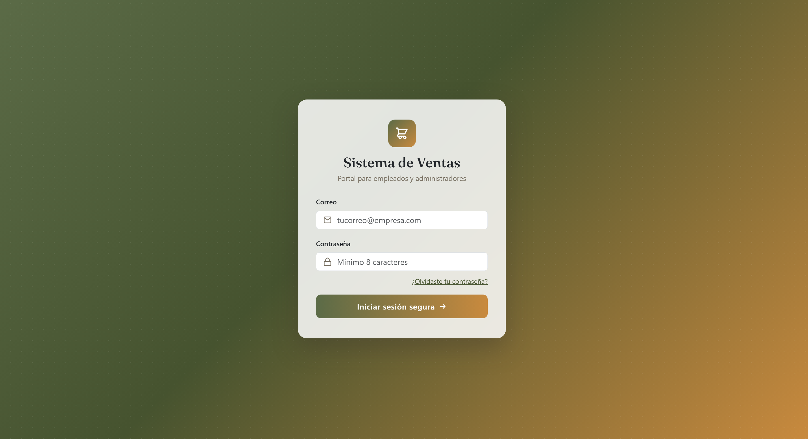
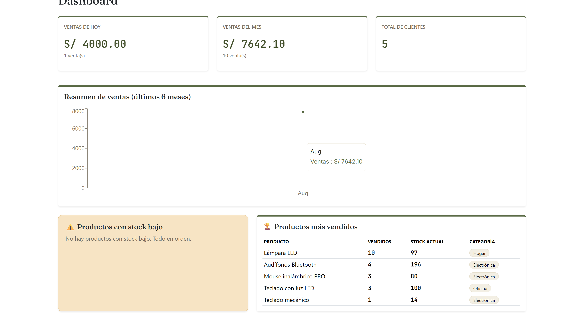
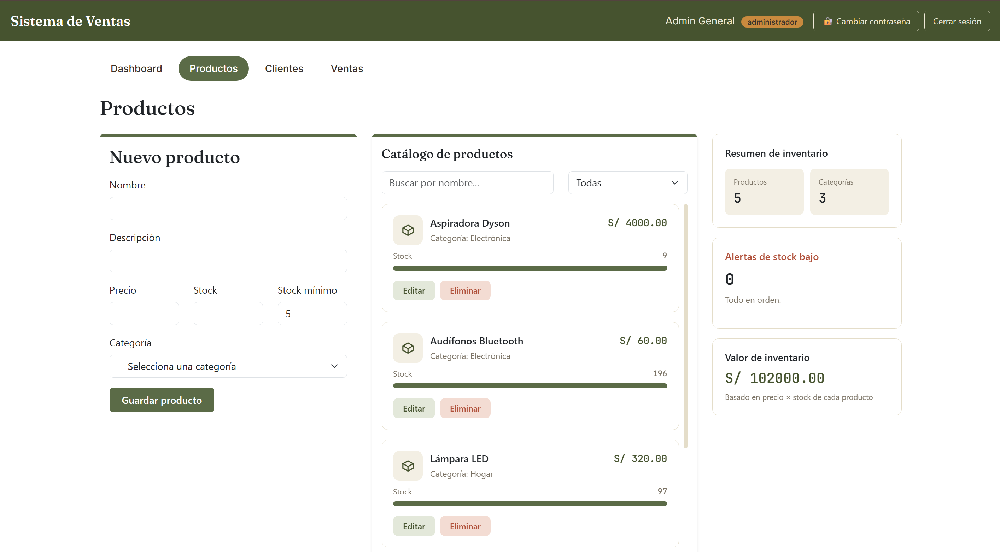
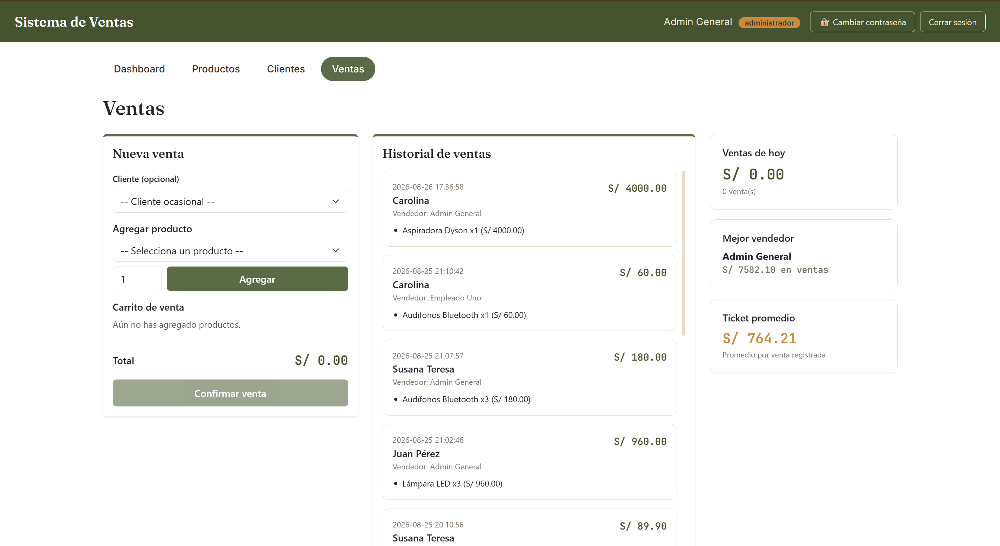

# Sistema de Gestión de Ventas e Inventario

Aplicación web full-stack para que pequeños negocios controlen productos, clientes, ventas e inventario desde un panel administrativo interno con diseño moderno y responsivo.

> 🔗 **Repositorio:** https://github.com/mcto2911/sistema-gestion-ventas

---

## 📋 Descripción

Este sistema permite a los trabajadores de un negocio (administradores y empleados) gestionar el catálogo de productos, registrar clientes, realizar ventas con control automático de inventario, y visualizar estadísticas clave a través de un dashboard en tiempo real.

**Funcionalidades principales:**
- Autenticación segura con roles (administrador, empleado)
- CRUD completo de productos, clientes y ventas
- Dashboard con gráficos de ventas y alertas de stock
- Carrito de compra con cálculo automático
- Cambio de contraseña para usuarios
- Búsqueda y filtros en tiempo real
- Diseño responsivo (desktop y móvil)
- Transacciones de base de datos para integridad de datos

> 🔒 **Nota:** Este es un sistema de backoffice (uso interno). No es una tienda online pública.

---

## 🖼️ Capturas de pantalla

### Login


### Dashboard


### Productos


### Ventas


---

## ⚙️ Tecnologías utilizadas

**Frontend**
- React (con Vite)
- JavaScript (ES6+)
- Bootstrap 5
- Recharts (gráficos)
- Fetch API

**Backend**
- PHP
- API REST (endpoints propios, JSON)
- PDO (PHP Data Objects) con prepared statements

**Base de datos**
- MySQL (motor InnoDB)

**Herramientas**
- Git y GitHub
- XAMPP (entorno local de desarrollo)

---

## ✨ Funcionalidades detalladas

### Autenticación y roles
- Login y cierre de sesión basado en sesiones de PHP
- Contraseñas protegidas con `password_hash()` / `password_verify()`
- Dos roles: **administrador** y **empleado**
- Protección de rutas en backend: los endpoints sensibles validan el rol antes de ejecutar acciones
- Cambio de contraseña seguro para usuarios logueados

### Productos
- CRUD completo (crear, listar, editar, eliminar)
- Eliminación "suave" (*soft delete*) para preservar historial de ventas
- Filtro por categoría y búsqueda por nombre en tiempo real
- Alertas visuales de stock bajo con barra de nivel
- Panel lateral con resumen de inventario

### Clientes
- CRUD completo con validación de email
- Búsqueda por nombre
- Alertas de datos incompletos (sin email o teléfono)
- Historial de clientes registrados

### Ventas
- Carrito de venta con múltiples productos y cantidades
- Cálculo automático de subtotales y total
- Descuento automático del inventario al confirmar
- **Transacciones SQL** para garantizar integridad de datos
- **Bloqueo de fila** (`SELECT ... FOR UPDATE`) para evitar condiciones de carrera
- Historial completo de ventas con detalles
- Resumen de ventas del día, mejor vendedor y ticket promedio

### Dashboard
- Ventas del día y del mes
- Total de clientes registrados
- Gráfico de área con evolución de ventas (últimos 6 meses)
- Productos con stock por debajo del mínimo
- Top 5 de productos más vendidos con stock y categoría

---

## 🗄️ Modelo de base de datos

```
usuarios
   ↓
ventas ←── detalle_venta ──→ productos ──→ categorias
   ↓
clientes
```

**Tablas:** `usuarios`, `categorias`, `productos`, `clientes`, `ventas`, `detalle_venta`.

El script completo de creación (con datos de ejemplo) está en [`db_schema.sql`](./db_schema.sql).

**Decisiones de diseño:**
- **Soft delete en productos:** preserva el historial de ventas (FK RESTRICT)
- **DELETE real en clientes:** relación diseñada con ON DELETE SET NULL
- **Subtotal GENERATED en detalle_venta:** suma automática, nunca desactualizada

---

## 🚀 Instalación local

### Requisitos previos
- [XAMPP](https://www.apachefriends.org/) (Apache + MySQL)
- [Node.js](https://nodejs.org/) (LTS)
- Git

### Pasos

1. **Clona el repositorio dentro de `htdocs`:**
   ```bash
   cd C:/xampp/htdocs
   git clone https://github.com/mcto2911/sistema-gestion-ventas.git
   cd sistema-gestion-ventas
   ```

2. **Inicia Apache y MySQL desde el Panel de Control de XAMPP.**

3. **Importa la base de datos:**
   - Abre `http://localhost/phpmyadmin`
   - Pestaña **Importar** → selecciona `db_schema.sql` → Importar

4. **Instala las dependencias del frontend:**
   ```bash
   cd frontend
   npm install
   ```

5. **Levanta el frontend:**
   ```bash
   npm run dev
   ```

6. **Abre `http://localhost:5173` en tu navegador.**

> El backend PHP no necesita instalación adicional: al estar en `htdocs`, XAMPP lo sirve automáticamente en `http://localhost/sistema-gestion-ventas/api`.

---

## 👤 Usuario de prueba

| Email | Contraseña | Rol |
|---|---|---|
| admin@tienda.com | 123456 | administrador |
| empleado1@tienda.com | empleado123 | empleado |

> Para cambiar contraseñas: inicia sesión y usa el botón "🔐 Cambiar contraseña" en la navbar.

---

## 📁 Estructura del proyecto

```
gestion-ventas/
├── api/                          # Backend PHP (API REST)
│   ├── config.php                # Conexión PDO + CORS
│   ├── login.php
│   ├── verificar_sesion.php
│   ├── logout.php
│   ├── cambiar_password.php
│   ├── listar_productos.php
│   ├── crear_producto.php
│   ├── actualizar_producto.php
│   ├── eliminar_producto.php
│   ├── listar_clientes.php
│   ├── crear_cliente.php
│   ├── actualizar_cliente.php
│   ├── eliminar_cliente.php
│   ├── crear_venta.php
│   ├── listar_ventas.php
│   ├── dashboard.php
│   └── listar_categorias.php
├── frontend/                     # Frontend React (Vite)
│   └── src/
│       ├── components/           # Formularios reutilizables
│       │   ├── FormularioProducto.jsx
│       │   ├── FormularioCliente.jsx
│       │   └── ModalCambiarPassword.jsx
│       ├── pages/                # Pantallas principales
│       │   ├── Login.jsx
│       │   ├── Dashboard.jsx
│       │   ├── Productos.jsx
│       │   ├── Clientes.jsx
│       │   └── Ventas.jsx
│       ├── services/             # Comunicación con la API
│       │   └── api.js
│       ├── App.jsx
│       ├── main.jsx
│       └── index.css             # Estilos y variables CSS
├── db_schema.sql                 # Script de base de datos
├── screenshots/                  # Capturas de pantalla
└── README.md
```

---

## 🧠 Decisiones técnicas destacables

### **Seguridad**
- **Prepared statements en todas las consultas:** previenen inyección SQL
- **password_hash / password_verify:** contraseñas hasheadas, nunca en texto plano
- **Sesiones PHP:** identificación del usuario en servidor (no cookies con datos sensibles)
- **Validación en el servidor:** no confiar solo en validación frontend

### **Integridad de datos**
- **Transacciones SQL (BEGIN/COMMIT/ROLLBACK):** una venta involucra múltiples tablas; si algo falla a mitad de camino, todos los cambios se revierten
- **SELECT ... FOR UPDATE:** bloquea filas mientras se procesan, evitando condiciones de carrera cuando dos usuarios venden el mismo producto simultáneamente

### **Control de acceso**
- **Cada permiso validado en el backend:** por ejemplo, "solo administradores pueden eliminar" se valida en PHP, devolviendo 403 si no tiene permiso
- **Frontend solo oculta opciones:** el verdadero control está en el servidor

### **Diseño de base de datos**
- **Soft delete vs delete real:**
  - Productos: eliminación suave (`UPDATE activo=0`) porque tienen FK RESTRICT con el historial de ventas
  - Clientes: DELETE real porque la relación con ventas es ON DELETE SET NULL
- **Relaciones bien definidas:** cada tabla tiene un propósito claro, sin redundancias

### **Frontend**
- **Components reutilizables:** FormularioProducto y FormularioCliente siguen el mismo patrón
- **Manejo de estado simple:** useState con un único objeto por formulario, no múltiples variables
- **Fetch con credentials:** `credentials: 'include'` para enviar/recibir cookies de sesión

### **UX/Diseño**
- **Paleta de colores coherente:** variables CSS reutilizables en todo el proyecto
- **Layout responsivo:** 3 columnas en desktop, apilado en móvil
- **Scroll independiente:** catálogos tienen su propio scroll, mientras formularios y resumen se quedan fijos

---

## 📊 Lo que aprendiste con este proyecto

Este proyecto toca **casi todo lo que necesitas saber para un rol junior/mid en full-stack:**

- ✅ Diseño relacional de bases de datos (normalización, FK, restricciones)
- ✅ SQL: JOINs, GROUP BY, transacciones, window functions
- ✅ PHP: PDO, sesiones, validación, manejo de errores
- ✅ API REST: HTTP verbs, status codes, CORS
- ✅ React: hooks, estado, efectos, componentes, props
- ✅ Seguridad: hashing, prepared statements, CSRF, validación dual (frontend + backend)
- ✅ Git: commits, rama main, historial
- ✅ Diseño UI/UX: paleta, tipografía, responsiveness, accesibilidad

---

Desarrollado por Carolina Tiznado Olivera.

